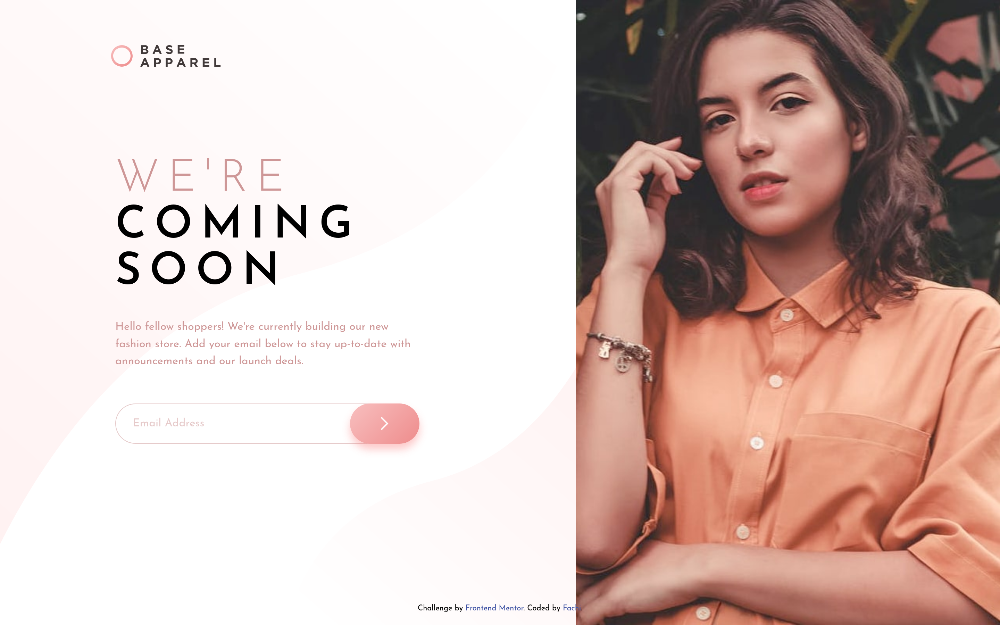

# Frontend Mentor - Base Apparel coming soon page solution

This is a solution to the [Base Apparel coming soon page challenge on Frontend Mentor](https://www.frontendmentor.io/challenges/base-apparel-coming-soon-page-5d46b47f8db8a7063f9331a0)

## Table of contents

<!--toc:start-->

- [Frontend Mentor - Base Apparel coming soon page solution](#frontend-mentor-base-apparel-coming-soon-page-solution)
  - [Table of contents](#table-of-contents)
  - [Overview](#overview)
    - [The challenge](#the-challenge)
    - [Screenshot](#screenshot)
    - [Links](#links)
  - [My process](#my-process)
    - [Built with](#built-with)
    - [What I learned](#what-i-learned)
      - [Picture Element](#picture-element)
      - [Grid Template Areas](#grid-template-areas)
      - [Relative CSS selectors](#relative-css-selectors)
      - [Validation on Form Submit](#validation-on-form-submit)
    - [Continued development](#continued-development)
      - [Revisit Font sizing](#revisit-font-sizing)
    - [Useful resources](#useful-resources)
  - [Author](#author)
  <!--toc:end-->

## Overview

### The challenge

Users should be able to:

- View the optimal layout for the site depending on their device's screen size
- See hover states for all interactive elements on the page
- Receive an error message when the `form` is submitted if:
  - The `input` field is empty
  - The email address is not formatted correctly

### Screenshot



### Links

- Solution URL: [Github](https://github.com/Fachi-r/base-apparel-coming-soon-master)
- Live Site URL: [Github Pages](https://fachi-r.github.io/base-apparel-coming-soon-master/)

## My process

### Built with

- Semantic HTML5 markup
- CSS custom properties
- CSS Grid
- Mobile-first workflow
- Javascript

### What I learned

Dynamic layouts are not as easy as I thought.
At first, I figured the `<picture>` tag and flex-box would be enough to
get this done, but I found out quickly that was not the case.

This was a great opportunity to get acquainted with css-grid layouts.
Since the layout would shift around in a non-linear manner, i.e.:

On mobile, your order is:

1. Header
2. Hero image
3. Content

On desktop, it becomes:

- Left column: Header + Content
- Right column: Hero image

That’s not a reversal. That’s re-grouping elements. Flexbox only reorders
siblings linearly. Grid lets you place things.

Therefore to implement this solution, here were a few notable pieces of
the puzzle:

#### Picture Element

Firstly, the HTML markup was pretty sane. The expected order of the
desktop layout (Header -> Hero -> Content).
The main container was `<main class="layout">`, the header
`<header class="header">`, hero `<picture class="hero">`, and the content
container was `<form class="content">`. All with semantic tags.

I recall from the last challenge I did, someone advised me that the better
way to do dynamic images is to use the picture element. And man we're
they right. I used this accordingly.

```html
<!-- Hero Image -->
<picture class="hero">
  <source
    srcset="./images/hero-desktop.jpg"
    media="(min-width: 720px)"
    alt="Desktop Hero Image"
  />
  
</picture>
```

easy as that.

#### Grid Template Areas

Next thing was the styling. This is was the cream of the challenge.
This was the setup for mobile view. Very descriptive:

```css
  .layout {
    display: grid;
    grid-template-columns: 1fr;
    grid-template-rows: auto;

    grid-template-areas:
      "header"
      "hero"
      "content";
  }

  .header {
    grid-area: header;
    ...
  }

  .hero {
    grid-area: hero;
    ...
  }

  .content {
    grid-area: content;
    ...
  }
```

And then for larger screens:

```css
@media (min-width: 720px) {
  .layout {
    grid-template-columns: 1fr minmax(1fr, auto);
    grid-template-rows: auto 1fr;
    height: 100vh;

    grid-template-areas:
      "header  hero"
      "content hero";
  }
}
```

This was in my opinion the main learning point of the challenge.

#### Relative CSS selectors

I also got a chance to practice CSS selectors.
This made it easier to style components related to the form like the
error icon, and error text, without leaving the scope/context.

```css
.email-input {
  ...
  color: var(--clr-grey-900);

  + .error-icon {
    position: absolute;
    top: 50%;
    right: 25%;
    ...
  }

  ~ .invalid-text {
    position: absolute;
    top: 100%;
    left: 1.5rem;
    ...
  }

  &.invalid {
    outline: 2px solid var(--clr-red-500);
    outline-offset: -2px;
  }

  &.invalid ~ * {
    opacity: 1;
  }

  &::placeholder {
    color: var(--clr-pink-400);
    opacity: 60%;
  }
}
```

#### Validation on Form Submit

Making sure the validation only happens when the user submits the email,
instead of as they type was a welcome Quality-of-Life addition.
Initially I did it the other way, but I can see how it would be annoying
for a form to yell at you about your email when you're not even done
typing it yet. So I used this JavaScript code to read the input state:

```js
submitButton.addEventListener("click", handleSubmit);

function handleSubmit(event) {
  event.preventDefault();
  let email = emailInput.value.trim();

  if (email == "" || emailInput.matches(":invalid")) {
    invalidateForm();
  } else {
    validateForm();
  }
}
```

### Continued development

#### Revisit Font sizing

I ran into a problem where the styling was perfect when using the dev tools in
the browser, on all devices, but when I viewed it natively in the browser, the
sizes turned out to be too small for some reason.
I'll need to look into this further and find the cause.
Alternatively, I could create a font scaling system using clamps based on the viewport width.
That way I wouldn't need to set discrete font size values.

### Useful resources

- [Josh Comeau's Custom CSS Reset](https://www.joshwcomeau.com/css/custom-css-reset) - This helped me avoid a few layout headaches with the images.
  I really liked this pattern and will use it going forward.
- [MDN Using Relative Colors Guide](https://developer.mozilla.org/en-US/docs/Web/CSS/Guides/Colors/Using_relative_colors) - This is an amazing article which helped me understand relative colors.
  I'd recommend it to anyone still learning this concept.

## Author

- Frontend Mentor - [@Fachi-r](https://www.frontendmentor.io/profile/fachi-r)
- Twitter - [@\_fachi_0](https://www.twitter.com/_fachi_0)
